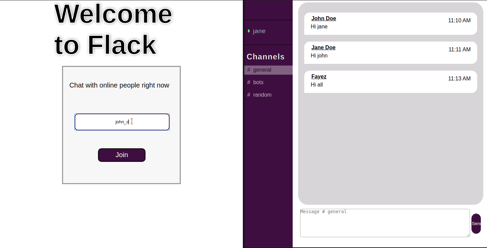

# Flack

Flack is a real-time messaging service using Flask and Socket.IO, similar in spirit to Slack.
This project is a submission in CS50 web development course. 

# Description

Users are able to sign in flack with a display name, create channels (i.e. chatrooms) to communicate in, as well as see and join existing channels. Once a channel is selected, users will be able to send and receive messages with one another in real time. Also, users will be remembered if they closed and got back to flack.

# Project Structure

* [application.py](application.py) : Contains The Flask server.

* [layout.html](templates/layout.html) : Containts the web pages layount markup.
* [index.html](templates/chat.html) : The first page a user sees to enable them to sign in with a display name.
* [chat.html](templates/chat.html) : chatrooms and messages markup.

* [index.js](js/index.js) : Responsible for remembering the users when they get back.
* [chat.js](js/chat.js) : Contains most of the chat UI and functional logic.
* [helpers.js](js/helpers.js) : Some helper functions that helped me.


# Personal Touch
Users are able to delete their own messages in real-time.

# Installation

Requires `Python>3.6`

```bash
git clone https://github.com/A-Fayez/flack.git && cd flack
pip3 install -r requirements.txt
python3 application.py
```

Now the server is run locally, navigate to [http://localhost:5000](http://localhost:5000).


# Further Improvements
* using `webpack` or any bundler instead of using a CDN.
* private chat rooms between users
